```{r setup, include=FALSE}
knitr::opts_chunk$set(echo = TRUE, collapse=T, comment="  #>")

# to do list
## open source and cross-platform

```

<!--------------------------------------------------> ____
# Prefácio 
Esta apostila está estruturada considerando três etapas: a apresentação do ambiente R, a sua linguagem de programação, considerando aspectos estruturais da linguagem, e por fim a apresentação do R com foco na rotina de análise da Ciência de Dados.  


<!--------------------------------------------------> ____
# O Ambiente R 
## O que é e por que usar? 
O R é uma linguagem de programação interpretada, além de um ambiente de software gratuito. Criado em 1995, no departamento de Estatística da Universidade de Auckland - Nova Zelândia, por Ross Ihaka e Robert Gentleman. Foi batizado como “R”, tanto pelo nome de seus criadores, quanto para fazer uma provocação à linguagem S, visto se tratar de uma implementação desta. 

O ambiente R é disponibilizado em diferentes tipos de plataformas, oferecendo um vasto leque de funcionalidades, bases de dados, e integrações com outras linguagens de programação, tudo acessível via bibliotecas. Tais bibliotecas podem ser instaladas ou desenvolvidas pelo próprio usuário, neste último caso permitindo a disponibilização em repositórios públicos para o acesso dos demais usuários. Em termos de suporte, o R possui uma comunidade extremamente ativa, engajada no aprimoramento direto da ferramenta, desenvolvimento de novas bibliotecas, e suporte gratuito dos usuários, por meio de fóruns online, encontros presenciais e materiais dos mais diferentes tipos. 

O R é descrito no seu site oficial (<https://www.r-project.org/>) como um ambiente para computação estatística e gráficos. Isto se deve a sua larga, coerente e integrada coleção de recursos para todo o workflow da análise de dados (leitura, limpeza, visualização, modelagem e comunicação de dados). Tendo ainda que se trata de um ambiente muito utilizado na academia, fazendo com que muitas metodologias novas sejam primeiramente implementadas no R. Somando tais características à amplitude e gratuidade da ferramenta, temos que o R atualmente é um dos principais ambientes para trabalhar com análise de dados.


## Da Instalação ao Hello World  
Para instalar o R o primeiro passo é entrar na página oficial do 'The R Project for Statistical Computing' (<http://www.r-project.org/>), página que incluí desde tutoriais e listas de mailing até a lista de eventos de interesse e o mapeamento de upgrades e bugs. E na sessão Downloads, opção CRAN, escolha o servidor do local mais próximo ao qual você se encontra, ou vá direto para <https://cloud.r-project.org>, escolha o seu sistema operacional (utilizaremos o Windows como referência), o subdiretório "base", e então fazer o download da versão mais recente do programa: 

```{r , echo=FALSE, out.width = '50%', fig.align = "center", fig.cap="R: Download."}
 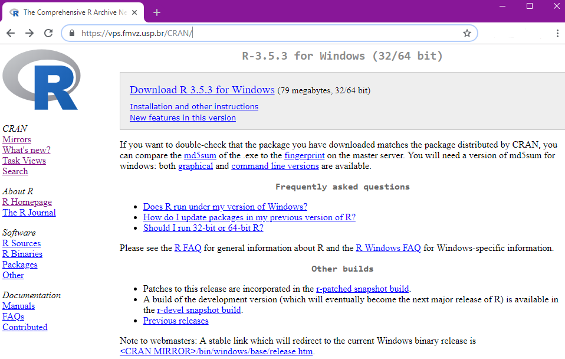
```

<!-- {width=5cm} -->

Click duas vezes no arquivo de instalação baixado, selecione o idioma de sua preferência, e então você estará no Assistente de Instalação. Caso você não seja administrador, na tela em que especifica a pasta em que o programa será instalado, é necessário alterá-lo para um repositório dentro do seu usuário. No mais, basta seguir o padrão de instalação do Windows até a conclusão da instalação. Pronto! Tendo o R na sua máquina, você pode acessa-lo via ícone na área de trabalho, busca do Windows, ou pelo executável que se encontra na pasta em que o R foi instalado. E ao digitar `"Hello World"` na janela "R Console" temos:
 
```{r , echo=FALSE, out.width = '50%', fig.align = "center", fig.cap="R: Hello World."}
 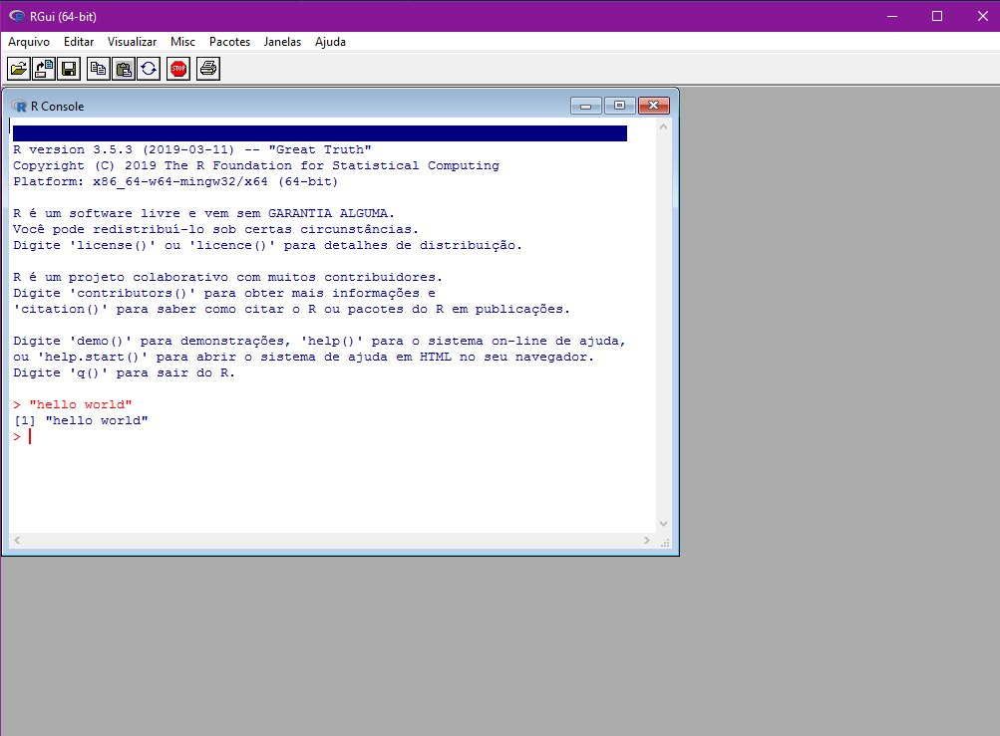
```
 
Via point-and-click temos opções que vão desde mudanças de diretórios até a instalação de bibliotecas. Porém, por se tratar de um interpretador, tais opções são limitadas, e temos poucos recursos em termos de usabilidade. Como alternativa podemos trabalhar em Ambientes de Desenvolvimento Integrados, ou IDEs, como são mais conhecidas (*Integrated Development Environment*). A mais difundida no caso do R é o **RStudio**:

### A IDE RStudio 
O RStudio é de uma IDE do R, amplamente difundida dado os seus muitos recursos, conforme poderemos vivenciar ao longo desta apostila. Para fazer o download do RStudio entre na página oficial do RStudio (<https://www.rstudio.com/>), na opção 'Download' RStudio, após passar pela descrição das opções disponíveis do RStudio, você encontrará a lista de instaladores organizados segundo os sistemas operacionais e processadores compatíveis: 

```{r, echo=FALSE, out.width = '50%', fig.align = "center", fig.cap="RStudio: Download."}
 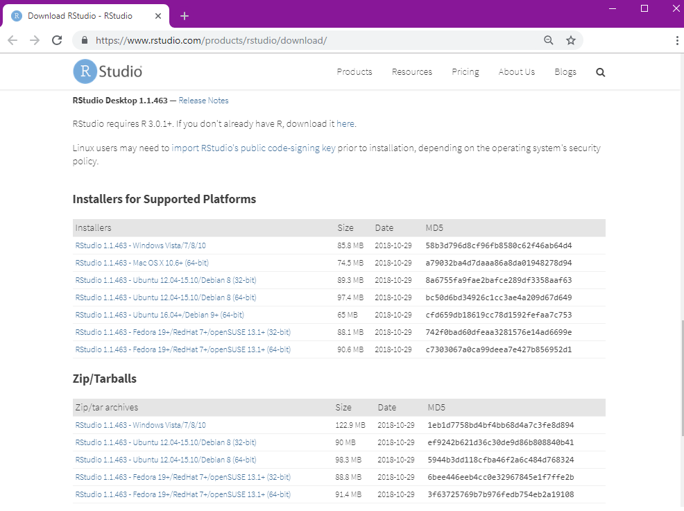
```

Caso você tenha acesso de administrador baixe a versão correspondente ao seu ambiente a partir da lista de *Installers for Supported Platforms*, abra o instalador e siga as instruções, até a conclusão da instalação. Caso não, faça o download a partir da lista *Zip/Tarballs*, e extraia os arquivos para a pasta desejada. Entre na pasta extraída e procure o diretório `\bin`, nele você irá encontrar um arquivo chamado rstudio, clique duas vezes e você estará no RStudio. E, similarmente ao caso anterior, ao digitar `"Hello World"` na janela Console, teremos: 

```{r, echo=FALSE, out.width = '50%', fig.align = "center", fig.cap="RStudio: Hello World."}
 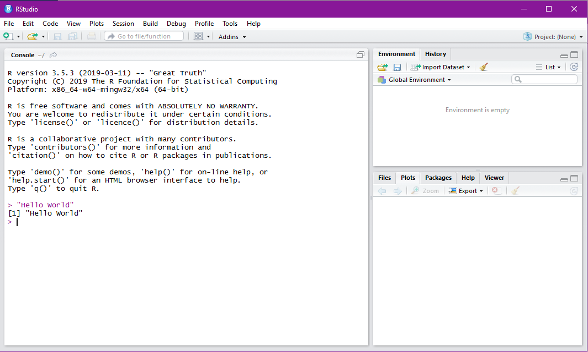
```

Para facilitar futuros acessos é recomendável fixar o programa na barra de tarefas, criar um atalho na área de trabalho, ou o que você julgar mais fácil para a sua utilização. Tanto o R quanto o RStudio são atualizados com frequência, de modo que é recomendado fazer updates regulares.


## Tour pelo RStudio 
O RStudio possui uma série de recursos que facilitam a utilização do R, uma delas é a própria interface, que apresenta algumas opções de painéis. Os dois principais são:

  - **Console**: painel onde os comandos são executados interativamente, permitindo opções como autocompletar e consultas por meio da tecla 'Tab', ou o acesso aos comandos já digitados via a tecla 'Seta para cima'; 

  - **Source**: onde são abertos os scripts do R, ou seja, onde você irá escrever o código, que só será enviado para o Console quando executado. Para abrir um script podemos ir via point-and-click 'File > New File > R Script' ou pelo atalho Ctrl+Shift+N; 
  
```{r, echo=FALSE, out.width = '50%', fig.align = "center", fig.cap="RStudio: Painéis."}
 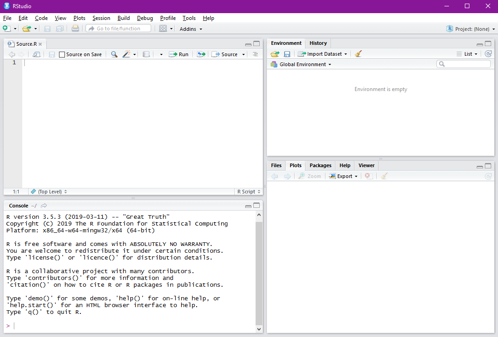
```

Adicionalmente temos também:

- **Environment**: listagem dos objetos definidos ao longo da sessão;
- **Files**: acesso às pastas e arquivos do computador;
- **Help**: menu de ajuda e visualização das documentações consultadas;
- **History**: consulta do histórico de comandos;
- **Packages**: gerenciamento das bibliotecas instaladas;
- **Plots**: visualização dos gráficos gerados; e
- **Viewer**: visualização dos relatórios e aplicativos gerados. 

Todos os painéis possuem uma série de funcionalidades próprias, sendo interessante que, conforme avance na sua utilização do R, volte a explorar tais opções. A mesma premissa vale para a barra de ferramentas do RStudio, onde é possível encontrar desde recursos de codificação, como indentação de linhas, até questões de Debug ou personalização da ferramenta, via 'Tools > Global Options':

```{r, echo=FALSE, out.width = '50%', fig.align = "center", fig.cap="RStudio: Layout dos Painéis."}
 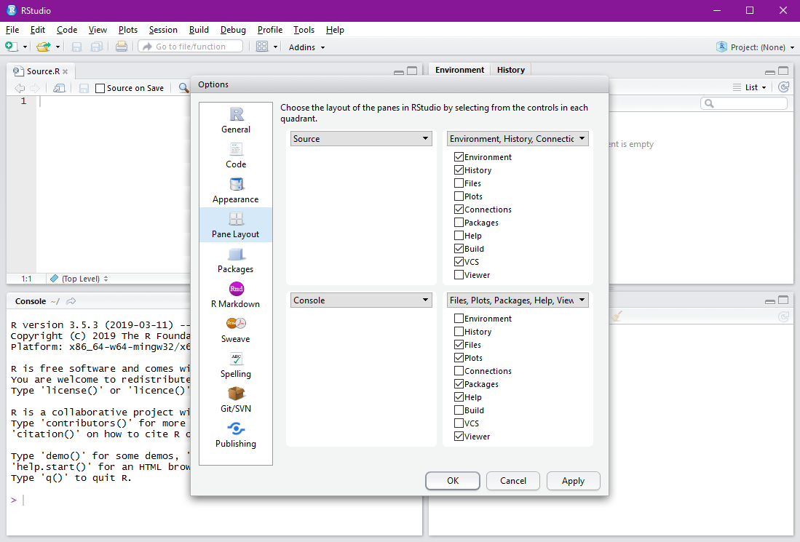
```


<!--------------------------------------------------> ____
# Programação em R  
## O R como calculadora  
Para a familiarização tanto com a interface básica do R, quanto com a sua IDE RStudio, vamos executar alguns comandos básicos no Console do R: 

```{r} 
#soma (o separador decimal no R é o ponto)
  1 + 1.5
```

Note que no Console do R os textos precedidos por `#` são comentários, enquanto que os antecedidos por `>` caracterizam resultados - neste material os resultados serão precedidos por ` #>`, visando diferencia-lo dos comandos:

```{r, echo=FALSE, out.width = '50%', fig.align = "center", fig.cap="RStudio: Calculadora."}
 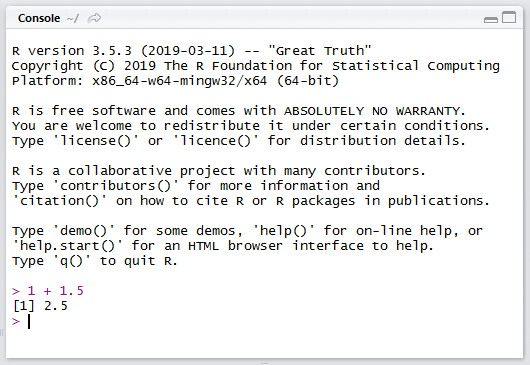
```

Seguem mais algumas operações aritméticas básicas:


```{r} 
#subtração
  7 - 2 
#divisão
  9 / 3  
#multiplicação
  100 * 10 
#potência
  2^4    
#resto da divisão de 10 por 3
  10 %% 3 
# parte inteira da divisão de 10 por 3
  10 %/% 3  
```

Em todos os casos o resultado foi precedido por `[1]`, o que faz referência à quantidade de elementos do resultado. Voltaremos a este ponto na seção de Vetores atômicos. 

O R permite ampliar as equações mantendo a notação básica de operações algébricas, como a aplicação hierárquica de parênteses ou de operações. Vale ressaltar que somente os parênteses podem ser utilizados nas expressões matemáticas, visto que as chaves `{}` e os colchetes `[]` possuem finalidades próprias (bloco de *statements* e *subsetting* de dados, respectivamente):

```{r, error=T, warning=T} 
#equação ok
  (2 * ( 2 * ( 2 * (4-3))))
#equação não ok
  (2 * { 2 * [ 2 * (4-3)]})

```

Podemos também trabalhar com operadores lógicos no R, tendo como saída `TRUE` ou `FALSE`. Note que podemos escrever dois comandos em uma única linha utilizando o símbolo `;` entre eles:

```{r}
#maior/menor
  1 < 0 ; 1 > 0 
#menor/maior ou igual
  1 <= 1 ; 1 >= 1 
#igual/diferente
  1 == 1 ; 1 != 1 
```

Uma outra forma de executar uma expressão no R, é escrever o código no Editor (*Source*, ou ainda *R Script*), e envia-lo para a execução no Console por meio do atalho 'Ctrl + Enter' ou pelo botão 'Run' do RStudio. 

No caso de digitarmos um comando incompleto no Console, como `8 ==` ou `6 + ` seguidos de 'Enter', o R mostrará o símbolo ``` + ```, o que não tem relação com o símbolo aritmético, mas sim que o R está aguardando os próximos comandos. Para iniciar um novo comando, desconsiderando comandos parciais anteriores, basta pressionar a tecla 'Esc'. Adicionalmente, no caso de comandos que o R não reconheça, ele retornará uma mensagem de erro, mas basta digitar o comando desejado na sequência: 

```{r, error=T} 
#erro
  3 % 9
```

> Para resgatar algum comando já digitado no Console, você pode utilizar a tecla 'seta para cima'.


## Aplicando funções 
Assim como em muitas linguagens de programação, uma função no R é de um conjunto de instruções organizadas visando executar uma tarefa. E nesta linguagem funções possuem um papel fundamental, visto não só há muitas opções disponíveis via instalação de bibliotecas, mas também as funções *built-in*, ou seja, funções já embutidas na sua instalação básica. Considerando apenas tais funções, podemos fazer desde cálculos aritméticos e leitura de dados, até tabelas, gráficos e modelos estatísticos. 

O nome de tais funções no R são, em geral, intuitivos, como a função `exp()` por exemplo, que calcula o exponencial de um número:

```{r}
#aplicando a função exponencial ao número 1
  exp(1)
#podemos ver o código da função ao digitar a função sem os parênteses
  exp
```

Uma das funções mais importantes no R é a função `help()`, ou ainda `?`, o seu operador equivalente. Pois por meio desta função temos acesso à documentação referente ao objeto que estivermos consultando - `help(função_desejada)` ou `?função_desejada`. Com isto temos acesso a informações como: descrição do objeto consultado, possibilidades de alterações, funções relacionadas, exemplos, entre outros. Consultando o help para a função `log` por exemplo, vemos que é possível mudar a base segundo a qual o logaritmo é computado, e como fazer isso:

```{r, echo=FALSE, out.width = '50%', fig.align = "center", fig.cap="RStudio: Help."}
 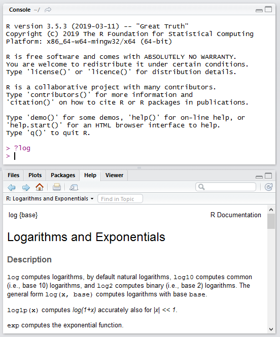
```


```{r}
#por default o log é calculado na base exponencial
  log(10)

#de modo que o resultado não é alterado mesmo se explicitarmos o argumento 'base'
  log(10, base = exp(1))
  
#mas podemos altera-lo para qualquer número positivo, como a base 10 por exemplo
  log(10, base = 10)
```

Note que não foi necessário especificar o nome do primeiro argumento da função em nenhum dos casos (`log(x=10)`). Isto porque no caso de não especificarmos os nomes dos argumentos, o R assume a lógica de posições. Tal prática não é recomendada nos casos em que utilizamos parâmetros não obrigatórios (como foi o caso do argumento `base`), ou para funções que possuem muitos argumentos.
  
No caso de consultas que envolvam objetos com caracteres especiais, é necessário que o texto esteja entre crases. Para consultar a documentação do comando `?`, por exemplo, precisamos digitar ``` ?`?` ```. No R podemos também obter ajuda considerando tópicos de modo mais geral, por meio das funções `help.search()` e `??`. 


> A função `builtins()` retorna todas as funções *built-in* disponíveis no R.

## Criando objetos 
Objetos no R são elementos que podem ser armazenados em variáveis - isto vale para dados, funções, símbolos e até expressões. Podemos criar objetos utilizando o sinal de `<-` ou `=`, para atribuições da direita para a esquerda, ou `->` para atribuições da esquerda para a direita. A recomendação é trabalhar com `<-` para atribuições de objetos, e `=` para a especificação de parâmetros, visto as características de cada um dos operadores. Existem ainda os operadores `<<-` e `->>`, que são usualmente utilizados no contexto de funções, quando há o interesse em trabalhar com objetos de uma forma mais ampla - não nos aprofundaremos no tema, para mais detalhes consulte ``` ?`<<-` ```.

Objetos podem ser nomeados com letras, números, e os símbolos `.` e `_`, desde que o nome não seja iniciado com números ou com um símbolo imediatamente seguido por um número. Adicionalmente, o R é uma linguagem sensível ao caso e, portanto, diferencia letras maiúsculas e minúsculas: 


```{r}
#síntaxe: letras minúsculas
  objeto <- 1 #da direita para a esquerda (RECOMENDADO)
  
#síntaxe: letras minúsculas com a primeira letra maiúscula
  Objeto =  2 #da direita para a esquerda

#síntaxe: letras minúsculas, símbolo e número
  3 -> objeto_1 #da esquerda para a direita
  
```

No R existem alguns nomes reservados para representar os seguintes casos especiais:

- **NA** (Not Available): dado faltante ou indisponível (similar ao null do SQL/SAS). 

- **NaN** (Not a Number): representa indefinições matemáticas, como o log de números negativos.

- **Inf** (Infinito): conceito matemático (positivo ou negativo).

- **NULL**: representa a ausência de informação, utilizada como retorno de funções cujos valores são indefinidos.

Podemos utilizar as funções com o prefixo `is.` para testar se um objeto é um destes valores:

```{r}
  is.na(NA)
  is.nan(NaN)
  is.infinite(Inf); is.infinite(-Inf)
  is.null(NA)
```

Ao criar objetos passamos a ter a informação que estes carregam salvos na memória, e podemos chama-los a qualquer momento. Assim, sempre que o R encontrar algum destes objetos, ele irá substituí-lo pelos valores armazenados, inclusive aplicando em funções: 

```{r, echo=FALSE, out.width = '50%', fig.align = "center", fig.cap="RStudio: Objetos."}
 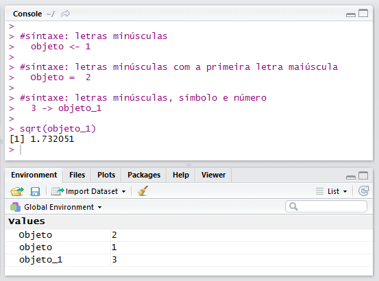
```

Além de criar objetos atribuindo elementos diretamente a eles, podemos fazer a partir de operações entre elementos, entre objetos e como resultados de funções. Adicionalmente, para excluirmos um objeto, podemos utilizar a função `rm(nome_do objeto)`:

```{r, error=T} 
#atribuindo um elemento diretamente
  a <- 3; a
#resultado de operações entre elementos
  b <- 5 + a; b
#excluindo o objeto a
  rm(a); a
  
#operações entre outros objetos
  c <-  b * (-1); c
#resultado da aplicação de funções
  d <- abs(c); d

```

É possível trabalhar com objetos nomeados com sintaxes não padrão no R, ou seja, nomes que contenham espaços ou caracteres especiais. Porém, para tal, é necessário que o nome do objeto esteja entre aspas, inclusive ao aplica-lo em alguma função. De modo que, sempre que possível, é interessante que tal padrão seja evitado: 

```{r} 
#definindo o objeto com sintaxe inválida
  `1¨ objeto c/ $int@xe que $&ria #inva!ida for@ da$ a$pa$` <- 6 

#aplicando-o em uma função (log na base 10)
  log10(`1¨ objeto c/ $int@xe que $&ria #inva!ida for@ da$ a$pa$`)
  
```

Para listar todos os objetos disponíveis na sessão podemos utilizar a função `ls()`, enquanto que para excluir algum destes objetos temos a função `rm(nome_do_objeto)`, ou ainda para apagar todos os objetos `rm(list=ls())`.


> Para inserir o símbolo de atribuição ``` <- ``` no RStudio podemos utilizar o atalho ``` 'alt + -' ```.


## Entendendo dados 
Para tirar maior proveito da linguagem R é importante entender os diferentes tipos e estruturas de dados disponíveis. Para tal, vamos primeiramente entender sobre os tipos de dados:

### Tipos de dados 
No R existem seis tipos de dados, que basicamente indicam como os objetos são armazenados (*low-level*):

  - **character**, textos ou strings:  `"a"` ou `"isto é um teste"` 
    
  - **numeric** (ou **double**), valores decimais: `6` ou `19.4`

  - **integer**, números naturais: `2L` ou `0L` (o `L` diz para o R armazenar o objeto como inteiro)

  - **logical**, valores booleanos: `TRUE` e `FALSE`

  - **complex**, números complexos: `1+4i` ou `1+3i`  
  
  - **raw**, bytes: `0a` ou `c8`

Para verificar qual é o tipo de armazenamento de um objeto, podemos utilizar a função `typeof()`. A função `class()` pode também ser utilizada, porém, visto que esta trabalha com a lógica hierárquica de classes da programação orientada a objetos, o resultado só será o mesmo do `typeof()` quando o objeto tiver a estrutura mais básica do R - vetores atômicos. Podemos também utilizar as funções `is.` e `as.` para testar e converter objetos, respectivamente:

```{r}
#definindo um objeto
  x <- 1
#o objeto é um inteiro?
  is.integer(x)
#conferindo o tipo do objeto (double e numeric são sinônimos no R)
  typeof(x) ; class(x)
#trasformando 'x' em um texto, e redefinindo o objeto
  x <- as.character(x)
#conferindo novamente o tipo do objeto
  class(x)
```

Tais definições são importantes pois algumas funções só farão sentido para determinados tipos de dados. Por exemplo: considerando o objeto `x` do exemplo acima, inicialmente, quando se tratava de um tipo numérico, fazia sentido aplicarmos funções aritméticas, enquanto que para o `x` final, armazenado como texto:

```{r, error=TRUE}
#tentativa de cálculo com um objeto de texto 
  log(x)
```

Uma característica do armazenamento de objetos no R, é que eles respeitam a seguinte hierarquia de coerção: character > complex > numeric > integer > logical > raw. Ou seja, se tentarmos colocar tipos diferentes de objetos em um mesmo vetor atômico - estrutura discutida na próxima seção - o R irá modificar o tipo dos objetos de modo que todos passem a pertencer à mesma classe. 

Tendo que objetos complexos e raw são pouco usuais, nos limitaremos a discutir: character, numeric, integer e logical. 


### Estruturas de dados 
Veremos agora como estes podem ser organizados em termos de estrutura, bem como sua criação, consulta, classe e operações disponíveis:

#### Vetores atômicos
Vetores atômicos são a estrutura mais básica do R, visto que mesmo um elemento escalar é considerado um vetor atômico de tamanho um. Usualmente chamados de vetores apenas, tais objetos se caracterizam por uma única dimensão, que guardam objetos atômicos, isto é, objetos de um mesmo tipo. 


- **Criação** <br>

A forma mais usual para criar um vetor no R é por meio da função ```c()```, que combina os elementos nele listados:

```{r}
#criação de vetores com o comando `c()`
  ex_vetor_character <- c("laranja", "roxo", "verde") 
  ex_vetor_character
  
  ex_vetor_numerical <- c(1,2,3,4,5)
  ex_vetor_numerical
  
  ex_vetor_integer <- c(1L,2L,3L,4L,5L) 
  ex_vetor_integer
  
  ex_vetor_logical <- c(TRUE, FALSE, TRUE, TRUE, FALSE)
  ex_vetor_logical
```

Existem muitas outras formas de definir vetores no R, como utilizando o operador `:`, que gera sequências, ou a função `rep()` que replica valores, ou mesmo a combinação entre tais funções:

```{r}
#opções para a criação de vetores
  ex_vetor_character2 <- rep("azul", times = 5) 
  ex_vetor_numerical2 <- 1:5
  ex_vetor_integer2 <- c(1L:3L,4L,5L)
  ex_vetor_logical2 <- c(TRUE, FALSE, c(FALSE,TRUE)) 
```


- **Consulta** <br> 

Para selecionar valores de um vetor, basta indicar o índice do elemento de interesse entre colchetes (o índice de contagem do R se inicia no 1, e não no 0):

```{r}
#consultando elementos de um vetor
  ex_acesso <- c("primeiro", "segundo", "terceiro")
  ex_acesso
  
#acessando o primeiro elemento 
  ex_acesso[1] 
  
#acessando o último elemento
  n <- 3; ex_acesso[n]
```

Para consultar múltiplos elementos, podemos indicar os índices de interesse por meio de um vetor:

```{r}
#consultando multiplos elementos de um vetor
  #por meio da função c()
    ex_acesso[c(2,4)]
  #ou qualquer função que retorne os índices
    ex_acesso[1:2]
  #podemos inclusive fazer consultas em outras ordens
    ex_acesso[5:1]
  #ou criar novos objetos a partir destes
    ex_acesso2 <- ex_acesso[c(1,3,5)]; ex_acesso2
  #ou ainda utilizar vetores lógicos
    ex_acesso[c(rep(TRUE,3), rep(FALSE,3))]
```

No R podemos inclusive fazer consultas a partir dos elementos que não temos interesse:
```{r}
#excluindo o primeiro elemento
  ex_acesso[-1]
#excluindo os três últimos elementos
  n <- 5; ex_acesso[-((n-2):n)]
```

Em relação ao `[1]` que precede o resultado no Console, conforme já comentado, se trata a quantidade de elementos do resultado, contabilizando a posição do primeiro elemento de cada linha. Como exemplo, se chamarmos o vetor `letters`, uma das base de dados built-in que o R disponibiliza, teremos a posição da primeira letra da segunda linha  `r` no vetor:

```{r}
#exemplo
  letters
```


- **Classe** <br>

Um vetor possui como classe o tipo dos objetos que guarda. Sendo importante ter em mente a hierarquia de coerção comentada na seção anterior:
  
```{r}
  ex_vetor_combinado <- c(ex_vetor_character, ex_vetor_integer)
  class(ex_vetor_combinado)
```

Algumas funções inclusive fazem a mudança na classe do objeto de forma automática:
```{r}
#coerção da classe lógica para inteira
  class(length(ex_vetor_logical)) #`length()` retorna o tamanho do objeto
#coerção da classe inteira para numérica
  class(cos(ex_vetor_integer)) #`cos()` retorna o cosseno de um número
#coerção da classe numérica para a de texto
  class(paste(ex_vetor_numerical)) #`paste()` concatena objetos
```


- **Operações** <br>

Para fazer operações entre vetores, o R alinha os objetos, e faz o cálculo elemento a elemento. 

```{r, error=TRUE}
#operação entre vetores do mesmo tamanho
  1:5 + 1:5
  paste(1:5,"_",1:5)
```

No caso dos vetores possuírem tamanhos diferentes, o R irá utilizar o esquema de reciclagem, ou seja, o vetor menor será repetido até completar o vetor maior:

```{r}
#operações entre vetores de tamanhos diferentes
  1:3 + 1
  
#operações entre vetores de tamanhos diferentes, múltiplos
  1:3 != 1:6

#no caso de objetos não múltiplos o R retorna o resultado + um aviso
  1:3 == c(1:3,4)
  
```


- **Atributos** <br>

O R permite que adicionemos atributos aos objetos, o que significa associar propriedades como: nomes, dimensões, classes, comentários, entre outros. Tais atributos não alteram a forma como o objeto é armazenado, mas especificam o comportamento do objeto para algumas funções. Podemos acessar os atributos vinculados a um objeto por meio da função `attributes()`, ou considerando funções próprias aos atributos. No caso dos vetores, falaremos dos atributos: nomes (`names()`), tamanho (`length()`) e classe (`class()`). O caso do tamanho e da classe, são atributos básicos, e por isso não são vinculados à função `attributes`:

```{r}
#verificando classe e tamanho, atributos básicos
  class(ex_vetor_integer); length(ex_vetor_integer)

#nenhum dos vetores que definimos até agora tiveram atributos vinculados
  attributes(ex_vetor_integer)

#adicionando o atributo nome
  names(ex_vetor_integer) <- c("um", "dois", "três", "quatro", "cinco")
  attributes(ex_vetor_integer)       

  #permitindo o acesso diretamente por seus respectivos nomes
  ex_vetor_integer["três"]
  
#para retirar os nomes podemos redefinir o objeto com a função unname
  ex_vetor_integer <- unname(ex_vetor_integer)
  attributes(ex_vetor_integer)
```

Por meio de tais atributos podemos construir casos especiais importantes:

##### Fatores 
Fatores são vetores atômicos que possuem um número limitado de categorias (níveis), o que nos permite trabalhar com variáveis categóricas, que são tratadas de forma diferenciada para algumas análises (como em modelos de regressão p.e.). Tais objetos podem ser armazenados como strings ou inteiros, e possuem nomes associados, chamados níveis, ou *levels*. Por padrão, o R armazena tais níveis em ordem alfabética:

```{r}
  ex_fator <- factor(LETTERS[1:5])
  ex_fator
#os fatores são armazenados de acordo com os tipos de objetos discutidos
  typeof(ex_fator)
#porém possuem uma classe própria
  class(ex_fator)
#que permite o uso de funções especificas
  levels(ex_fator)
```

Os fatores permitem que seus níveis sejam ordenados, de modo que podemos diferenciar as variáveis categóricas nominais e ordinais, em que:

- variáveis nominais: são variáveis que possuem categorias sem qualquer tipo de ordenação entre elas e, portanto, não podem ser submetidas a operações aritméticas. Como exemplos podemos citar: cores, marcas ou sexo. 

```{r}
  var_nominal <- c(rep(0,2), rep(1, 3)); var_nominal
  var_factor <- factor(var_nominal); var_factor
  
#podemos checar os níveis de fator 
  levels(var_factor) 
  
#e altera-los
  levels(var_factor)[1] <- "masculino"; levels(var_factor)[2] <- "feminino"
  
#e inclusive adicionar níveis à variável
  levels(var_factor) <- c(levels(var_factor), "prefiro não responder")
  
#e assim visualizar os resultados da varíavel, mesmo sem observações vinculadas
  table(var_factor)
```

- variáveis ordinais: possuem uma ordenação entre as suas categorias, apesar de não haver uma escala bem definida entre as categorias. De modo que podemos fazer alguns cálculos, como a obtenção do nível máximo. Como exemplos podemos citar: classe social, escolaridade ou pesquisas de opinião do tipo concordo/neutro/discordo.     

```{r}
  var_ordinal <- factor(c(rep("baixo",2), rep("alto", 3))); var_ordinal

  var_ordinal <- ordered(var_ordinal); var_ordinal
  
#podemos fazer a alteração redefinindo os níveis
  levels(var_ordinal) <- c("baixo", "alto"); var_ordinal
```

Visto ser um caso particular dos vetores a forma de acesso é a mesma. No mais podemos utilizar funções como: `is.factor`/`is.ordered` e `as.factor`/`as.ordered`.

##### Datas 
O R possui uma classe própria para objetos que armazenam datas. De modo que para transformar um elemento para tal classe podemos utilizar a função `as.Date()`: 

```{r}
  ex_date <- as.Date(c("1988-03-25", "2019-03-25"))
  typeof(ex_date)
  class(ex_date)
```

Ou ainda:

```{r}
  as.Date("01/12/2012", format = "%d/%m/%Y")
```

Abaixo estão listadas algumas outras alternativas de formato - para mais opções consulte `?strptime`:

- %d: dias numéricos (0-31)
- %a: dias da semana, abreviados (Mon)
- %A: dias da semana, não abreviados	(Monday)
- %m:	meses numéricos (00-12)
- %b: meses em texto, abreviados (Jan)
- %B: meses em texto, não abreviados	(January)
- %y: anos com dois dígitos (19)
- %Y:	anos com quatro dígitos (2019)

<!-- Tal classe representa números desde '1970-01-01', com valores negativos para os dias anteriores.  -->
Desta forma podemos fazer cálculos cabíveis à dados desta natureza, como, por exemplo, a quantidade de dias entre duas datas:

```{r}
  ex_date[1] - ex_date[2]
```


#### Matrizes e arrays
 
Matrizes são estruturas que nos permitem trabalhar com dados bidimensionais que contenham o mesmo tamanho e o mesmo tipo de dados. Arrays são similares, porém permitindo mais que duas dimensões. Para criar uma matriz, podemos ou atribuir o atributo dimensão a um vetor, por meio da função `dim()`, ou reorganizar um vetor por meio de funções específicas:

```{r}
  x <- 1:8

#criando uma matriz a partir da atribuição de dimensões
  dim(x) <- c(2,4); x

#ou definindo uma matriz a partir do número de linhas
  matrix(x, nrow = 2)
  matrix(x, nrow = 2, byrow = TRUE)
  
#pelo número de colunas
  matrix(x, ncol = 2)

#ou ainda, ambos
  ex_matriz <- matrix(x, 2, 4); ex_matriz
```

No caso da criação de um array é necessário definir um vetor como primeiro argumento, e um vetor com as dimensões como segundo:

```{r}
  ex_array <- array(x, dim = c(2, 2, 2)); ex_array
```

- **Consultas** <br>

A consulta de valores se dá de modo similar aos vetores, com a diferença de precisarmos identificar qual a dimensão que estamos interessados, utilizando vírgulas para separar as dimensões, especificadas em ordem crescente:

```{r}
#matriz
  ex_matriz[1,1] 
#array - consulta do valor contido no cruzamento do primeiro elemento das três dimensões
  ex_array[1,1,1]
#array - consulta do valor contido no primeiro elemento da terceira dimensão
  ex_array[ , ,1]
  
#podemos também consultar informações como a dimensão do objeto 
  dim(ex_array)
```

- **Classe** <br>

Estas estruturas possuem classes próprias:
```{r}
  class(ex_matriz)
  class(ex_array)
```


- **Operações** <br>

Em relação às operações, as matrizes e arrays funcionam similarmente aos vetores, além de permitirem cálculos algébricos:

```{r}
#operações entre objetos
  rep(2,4) * ex_array

#matriz transposta
  t(ex_matriz)     

#multiplicação matricial
  ex_matriz %*% t(ex_matriz)
```


#### Data frames 
Data Frames são estruturas bidimensionais mais genéricas que as matrizes, uma vez que as colunas podem conter tipos de objetos diferentes. Tais estruturas, similares a uma tabela SQL ou uma planilha do Excel, são usualmente o formato que dados importados ao se ler dados no R:  

```{r}
#é possível criar data frames a partir de objetos existentes
  idade <- c(31,30,25,40)
  classe <- factor(c("AB", "C", "C", "B"), ordered = T)
  flag <- c(TRUE,TRUE,NA,FALSE)
  ex_df <- data.frame(idade,classe,flag); ex_df
  
#ou diretamente, especificando, ou não, o nome das colunas
  data.frame(nome_da_coluna1 = 1:3, 4:6)
```

- **Consulta** <br>
Além das consultas similares às que vimos para as demais estruturas, um data.frame permite algumas outras opções:

```{r}
#considerando o nome das colunas
  ex_df[c("idade","classe")]
  ex_df$idade
  
#as linhas de interesse  
  ex_df[c(2,4),]
  ex_df[ex_df$idade>30,]
  ex_df[which(flag==TRUE),] 
  
# ou ambos  
  ex_df[1:2,"flag"]
  ex_df[1,1:2]
```


- **Classe** <br>
Os Data Frames possuem uma classe própria, podendo ser consultada via `is.data.frame()` ou aderida com `as.data.frame()`. Porém, em ambos os casos, os elementos do data.frame permanecem com  as suas próprias classes:

```{r}
  class(ex_df)
  class(ex_df$idade)
```


- **Operações** <br>

Aqui temos todas as opções já discutidas, tendo como restrição apenas se o tipo de objeto é cabível:

```{r}
  ex_df$idade + 1
  ex_df$classe == "C"
```


#### Listas 
Listas são estruturas também de uma dimensão, similarmente aos vetores, porém permitindo que diferentes tipos de objetos sejam guardados em um único vetor. Para a construção de listas utilizamos `list()` ao invés de `c()` - além de termos as opções `is.list()` e `as.list()`:

```{r}
  list(4L, "a", TRUE)
```

Listas são também conhecidas como vetores recursivos, isto porque uma lista pode conter outras listas, de diferentes tamanhos. Tal característica permite que sua dimensão seja ampliada, e esta possa conter inclusive data frames: 

```{r}
  ex_list <- list(9:1, ex_df = ex_df, TRUE)
  ex_list
```

Por tais características listas são as estruturas mais genéricas no contexto de dados.


- **Consultas** <br>

Para consultar elementos de uma lista, podemos seguir o padrão dos vetores usando `[`, tendo sempre listas como retorno. Ou por meio de `[[` - ou `$` caso os elementos sejam nomeados - tendo como retorno a classe do elemento consultado:


```{r}
  ex_list[1] ; class(ex_list[1])
  ex_list[[1]] ; class(ex_list[[1]])
  ex_list$ex_df ; class(ex_list$ex_df)
```

Podemos também acessar os elementos de cada um dos sub-objetos, seguindo o padrão de consultas das suas estruturas originais:

```{r}
  ex_list[[1]][1]
  ex_list$ex_df[1,1]
```


- **Classe** <br>

Listas possuem uma classe própria e, assim como o data frame, permite que seus elementos mantenham as suas próprias classes:

```{r}
  class(ex_list)
  class(ex_list[[1]])
  class(ex_list$ex_df)
  class(ex_list[[3]])
```


- **Operações** <br>

Listas seguem a mesma lógica dos vetores e data.frames em relação às operações, com esquema de reciclagem e coerção:
```{r}
#operação entre elementos da lista
 paste(ex_list[[1]][1:4], ex_list[[3]])

#operação com uma coluna específica do data frame
 ex_list$ex_df$idade + ex_list[[1]]
```


> Para tirar dúvidas sobre como consultar os diferentes tipos de objetos no R utilize consulte o help `?Extract` ou `?Syntax`.


## Analisando dados 
Agora que temos familiaridade com os dados no R, vamos análisar uma base de dados do próprio R, visando apresentar algumas das funções *built-in* disponibilizadas para tal, bem como apresentar formas de importar/exportar dados.

### Análises Descritivas
Iremos trabalhar com a base `mtcars`, uma das bases disponíveis por default no R. Por se tratar de uma base *built-in*, apesar dela ser normalmente retornada no console, para que ela conste como um dos objetos no `Environment` da sessão de trabalho, o seguinte comando é necessário: `data(mtcars)`. Para mais detalhes sobre a referida base de dados, contulte: `?mtcars`. 

```{r}
#base para exemplo
  mtcars
```

O primeiro ponto é como ter uma visão geral dos dados, para tal temos algumas opções como: 


- `head()` - que retorna as primeiras linhas da base de dados, ou similarmente a função `tail()` que contempla as últimas linhas:

```{r}
head(mtcars)
tail(mtcars)
```


- `str()` - exibe a estrutura interna de um objeto, no caso da base de dados que estamos trabalhando p.e., temos: a estrutura dos dados (data.frame), o número de linhas (32 observações) e colunas (11 variáveis), além da classe de cada uma das colunas, e uma amostra das primeiras observações de cada uma das colunas: 

```{r}
  str(mtcars)
```

- `summary()` - é uma função genérica usada para produzir resumos de resultados segundo várias funções descritivas, no caso de variáveis numéricas, por exemplo: 

```{r}
#primeiras colunas
  summary(mtcars[,1:4])
```

As mesmas informações obtidas oderiam ser acessadas por meio das funções , temos estatísticas como média (`mean()`), mediana (`median()`) ou máximo (`max()`), porém precisariam ser aplicadas a cada uma das colunas - ou por meio de loops, que veremos na próxima seção. No que se tivessemos outras classes de dados no data.frame a função `summary()` retornaria outras estatísticas, como por exemplo:

```{r}
  ex <- data.frame(var_logical = c(TRUE,TRUE,FALSE,TRUE,FALSE),
                   var_factor = factor(c("A","A","B","B","C"), ordered = TRUE))
  str(ex)
  summary(ex)
```

Para aumentar o grau de entendimento da base, podemos visualizar os dados, por meio do `boxplot()`, que apresenta parte das informações do `summary()` de forma gráfica: 

```{r}
  boxplot(mtcars)
```

Ou entender a relação entre os dados, considerando, por exemplo a matriz de correlações, que avalia as variáveis dois a dois, tanto do ponto de vista gráfico quanto numérico:

```{r}
#considerando as 3 primeiras colunas:
  #gráfico
    plot(mtcars[,1:3])
  #numérico
    cor(mtcars[,1:3])
```

Similarmente, podemos aplicar testes estatísticos (e.g. `t.test()`), modelos de regressão/supervised models (`lm()`), análises de cluster/unsupervised (`kmeans()`) entre outras. Contudo, tendo sempre em mente que tais técnicas possuem diferentes opções de parâmetros, além de premissas metodologicas que, caso não respeitadas, podem nos levar a conclusões equivocadas.

Outro aspecto importante de uma análise diz respeito a transformações que podemos ter o interesse em fazer, como reordenar uma coluna, ou substituir algum elemento. No caso das bases *built-in* não temos o poder de fazer tais alterações, sendo assim podemos salvar uma base paralela para tais alterações - a prática de não alterar os dados originais trata-se de uma das boas práticas na análise de dados:

```{r}
dados_mtcars <- mtcars

#arredondando os dados para uma casa decimal
  dados_mtcars$qsec <- round(dados_mtcars$qsec,1)
#substituindo os valores pela descrição que consta no `?mtcars` da variável
  dados_mtcars$vs <- factor(dados_mtcars$vs, labels = c("V","S"))
  
#assim
  str(dados_mtcars)
  
```

> Para consultar as bases de dados disponibilizadas por default pelo R, e pelas bibliotecas carregadas na sessão corrente: `data()`. Para consultar as princípais funções estatísticas/machile learning disponíveis por default: `library(help = "stats")`.

### Importação/Exportação
Visando facilitar a dinâmica, vamos primeiro exportar a base de dados criada no último capítulo `dados_mtcars`, e então vamos importar esta mesma base de dados novamente. Para exportar os dados precisamos especificar o nome e a extensão que o arquivo será salvo, por exemplo:

```{r}
write.table(dados_mtcars, file = "dados_mtcars.txt")
```

Uma pergunta natural seria: onde o arquivo foi salvo? É a resposta é: no diretório de trabalho. Para saber qual o diretório de trabalho atual, utilizamos o comando `getwd()` (*get working directory*), o que nos retornará algo como `"C:/Users/Documents"`. Enquanto que para alterar o diretório de trabalho temos a função `setwd()` (*set working directory*), por meio de comandos como `setwd("C:/Users/Desktop")`. 

Alternativamente podemos especificar o destino do arquivo de interesse, de modo independente do diretório de trabalho, precedendo o nome do arquivo com o diretório desejado, considerando o caso assim p.e.: `write.table(dados_mtcars, file = "C:/Users/dados_mtcars.txt")` - note que trabalhamos com barras simples (`/`) para especificação de diretórios. 

Para a leitura de dados seguimos o mesmo padrão, assim:

```{r}
  dados_lidos <- read.table("dados_mtcars.txt")
  str(dados_lidos)
```

Tanto a função `write.table()` quanto a `read.table()`possuem uma série de parâmetros, permitindo especificações de separadores, títulos e comentários, e variações, permitindo trabalharmos com outras extensões.

> para consultar funções relacionadas pesquise os tópicos `??read` e `??write`.

## Estruturas de controle 
No que se refere as estruturas de controle - blocos de programação que, baseado em parâmetros pré-definidos, define a direção a seguir - o R possui todas as funções usualmente existentes em outras linguagens de programação. Assim, considerando os operadores lógicos abaixo:

```{r, eval=F}
#retorna TRUE (T) ou FALSE (F) se:
  !x #não
  x | y #ou: retornando T/F para cada elemento das comparações
  x || y #ou, retornando apenas um T/F (1ª comparação à esquerda do vetor)
  x & y #e, retornando T/F para cada elemento das comparações
  x && y #e, retornando apenas um T/F (1ª comparação à esquerda do vetor)
  x %in% y #se os elementos à esquerda, um a um, estão contidos à direita
```

Temos as principais estruturas considerando fluxos condicionais e de repetição são:

- **if** - se a declaração testada for verdade, ou seja, retornar `TRUE`, então os comandos especificados dentro das chaves `{}` serão executados: 

```{r}
x <- 1
  if(x != 0){
    print(x+1)
  }
```

- **if-else** - similar ao comando `if()` porém seguido de um segundo bloco, que será avaliado se, e somente se, o resultado do primeiro bloco for `FALSE`: 

```{r}
x <- 30
  if (x<=10) {
    print("x é menor ou igual a 10")
  } else if (x>10 & x<20) {
    print("x está entre 10 e 20")
  } else{
    print("x é maior ou igual a 20")
  }
```
  
Existe também uma versão mais simples, em que especificamos a ação a ser tomada se a condicional especificada falsa `ifelse(condição, "se TRUE", "se FALSE")`.

- **for** - uma sequência de instruções que são repetidas com cada um dos elementos especificados:

```{r}
#exemplo
  x <- 1:3
  for(i in x){
    print(i)
  }
```

Podemos trabalhar sem as chaves caso as instruções sejam dadas em até uma linha após o comando `for`:

```{r}
#exemplo
  x <- 1:3
  for(i in x) print(i)
```

- **nested loops** - De modo similar ao anterior temos o caso dos loops aninhados:

```{r}
#exemplo ~ podemos utilizar a função `seq` para acessar os indíces de interesse
  x <- 1:2; y <- c(1,10)
  for(i in seq(x)){
    for(j in seq(y)) print(x[i]*y[j])
  }
```

- **while** - repetição de um bloco de comandos até que certa condição não seja mais satisfeita:

```{r}
#exemplo
  i <- 1
  while (i<=6){
    print(i*i)
    i = i+1
  }
```

além dos comandos citados, funções como `break()`, que pode ser utilizado para interromper um loop e dar continuidade ao fluxo do programa, ou `next()`, que descontinua uma interação particular, e pula para a próxima, também existem no R. Além do `repeat()`, um loop que executa um bloco de comandos repetidamente, até que o mesmo seja quebrado. 


## Criando funções 
No R podemos criar as nossas próprias funções, por meio do `function()`, pratica que evita retrabalho, e permite um código mais simples e mais facilmente reprodutível. Para criar funções existem três características: o nome do objeto criado para a função ser armazenada, os argumentos que a função pode, ou não, possuir, e o corpo da função, onde é definido o que a função faz, e o que retorna.  

```{r, eval=F}
#modelo
  nome_funcao <- function(arg_1, arg_2, ...){
     corpo da função
  }
```

Em relação ao retorno da função, o R, por default, retorna a última linha do corpo da função, porém, alternativamente, podemos utilizar a função `return()`, que garante o retorno independente da posição em relação aos demais item do corpo da função.

Outro aspecto importante trata dos ambientes das funções, uma vez que estas possuem seu próprio `environment`, de modo que os objetos e cálculos feitos dentro da função não alteram, e não são registrados nos demais ambientes. Por outro lado o `environment` da função consegue consultar o ambiente em que a função foi definida (`parent environment`), bem como o ambiente pai deste, e assim por diante, de forma hierarquica. Tal recurso é utilizado no contexto em que algum objeto necessário para a execução da função não é encontrado. Como exemplo vamos analisar a função `celcius_fahrenheit` definida abaixo, em que para a temperatura em celsius `temp_c` a respectiva temperatura em fahrenheit `temp_f` é calculada, porém o resultado só retornado quando chamamos a função `celcius_fahrenheit()`, e não para o objeto `temp_f`: 

```{r, error=T}
  temp_c <- 25
  
  celcius_fahrenheit <- function(){
    temp_f <- (temp_c * 9/5) + 32
    temp_f #ou, equivalentemente, return(temp_f)
  }

  temp_f
  celcius_fahrenheit()
  temp_f
```

Revisitando os pontos anteriormente comentados, temos que : 
- como a função não encontrou o objeto `temp_c` em seu environment, passou a procura-la no ambiente em que a função foi definida, no caso, o `Global Environment`, onde encontrou o objeto `temp_c` com o valor `25`;
- apesar da função conseguir acessar o ambiente em que foi criada, ela não tem o poder de gravar objetos fora do seu próprio `environment`. Sendo assim o objeto `temp_f` só "existe" dentro da funçao, e ao ser chamado fora desta não é encontrado; e
- a função ao ser chamada no `Global Environment` retorna a sua última linha, no caso o resultado do objeto `temp_f` - mas não o objeto em si.

O exemplo acima foi dado visando ilustrar como o R lida com os diferentes ambientes, porém, em termos práticos é extremamente desaconselhável deixar que a função dependa de parâmetros externos ao seu próprio `environment`. De modo que todas as dependências devem ser especificadas e passadas como argumentos da função, assim:

```{r, error=T}
celcius_fahrenheit <- function(temp_c){
    temp_f <- (temp_c * 9/5) + 32
    temp_f
}

temp_c <- 25
celcius_fahrenheit()
celcius_fahrenheit(temp_c)

#ou o que faremos mais recorrentemente
temp_f <- celcius_fahrenheit(temp_c)

```

Em relação aos argumentos, assim como ocorre nas funções *built-in*, podemos especificar valores default para os parâmetros, bem como definir o corpo da função em uma mesma linha sem o uso de chaves, como descrito para o `for()`:

```{r}
  ex_function <- function(x, y=1) x+y
  ex_function(1,0)
  ex_function(1)
```

Adicionalmente podemos utilizar recursos como `break()` ou `cat()` (uma versão um pouco menos generica da função `print()`), permitindo, por exemplo:

```{r, error=T}
celcius_fahrenheit <- function(temp_c){
    temp_f <- (temp_c * 9/5) + 32
    
    if(temp_c>10){ 
      cat("\n Por que 10? Porque sim! \n") 
      stop 
      }
    
    temp_f
}

celcius_fahrenheit(25)

```


> Ao definir funções, podemos salva-las em outros scripts e chama-las por meio da função `source()`, sendo necessário especificar apenas o nome do script (juntamente com o diretório caso não se encontre no mesmo diretório).

 
## Trabalhando com bibliotecas 
Bibliotecas tratam-se de uma coleção de funções, dados e códigos compilados. A instalação destas bibliotecas, ou pacotes, como são também chamados, é simples, podendo ser feita via point-and-click ('Tools > Install.Packages'), ou pelo comando `install.packages("nome_do_pacote")`. Após a instalação é necessário apenas carregar os pacotes desejados, por meio do comando `library(nome_do_pacote)` - sem aspas duplas, ou ainda indo diretamente na janela *Packages* do RStudio, e setando as bibliotecas que deseja carregar: 

```{r, eval=FALSE}
#instalação do pacote `ggplot2`
  install.packages("ggplot2")

#carregando o pacote
  library(ggplot2)

```

Tais bibliotecas se encontram disponíveis pela rede de distribuição oficial do R, o CRAN (do inglês *Comprehensive R Archive Network*). Mas existem também bibliotecas disponibilizadas via repositórios abertos, como o GitHub, ou disponíveis para download, em ambos os casos sem necessariamente constarem no CRAN. Nestes casos é necessário fazer a instalação com `devtools::install_github("nome-do-repo/nome-do-pacote")`, após a instalação do pacote `devtools`, ou, no caso de um arquivo zipado, adicionando o parâmetro `repos = NULL`, na função `install.packages()`.

```{r, eval=FALSE}
#instalação do pacote a partir do CRAN
  install.packages("ggplot2")
#instalação a partir do git (versão mais recente da biblioteca)
  install.packages("ggplot2")
  devtools::install_github("tidyverse/ggplot2")
#instalação a partir de um arquivo .zip
  install.packages("C:/Users/ggplot2.zip", repos = NULL)
```

Um ponto importante é que uma vez que a biblioteca esteja instalada, não é necessário carregar toda a biblioteca para utilizar uma função especificamente, sendo suficiente utilizar o nome da biblioteca, seguido por `::` e o nome da função desejada, ou seja:  `nome_da_biblioteta::função_de_interesse()`. Tal recurso é interessante visto que ao fazer o load de uma biblioteca, todas as funções desta se sobrepõem as que já estão carregadas. E como é comum que pacotes diferentes compartilhem funções com o mesmo nome, está torna-se uma forma de evitar tal problema - note que este recurso foi utilizado no caso do `devtools::install_github()` do exemplo acima.

Para checar quais bibliotecas estão instaladas podemos checar a aba `Packages` do RStudio, ou por meio do comando `installed.packages()`. Outro ponto importante são as atualizações das bibliotecas, que pode ser feita para todas as blibotecas por meio do comando `update.packages()`, ou reinstalando o pacote de interesse - para consultar quais estão desatualizadas temos `old.packages()`. 


<!--------------------------------------------------> ____
# R para Ciência de Dados 
Vamos agora explorar o R do ponto de vista da Ciência de Dados, considerando um ciclo usual de análise da ciência de Dados, considerando: leitura, organização, transformações, visualizações, modelagens e comunicação, e as possíveis repetições cabíveis:

```{r , echo=FALSE, out.width = '70%', fig.align = "center", fig.cap="Workflow de Análise da Ciência de Dados"}
 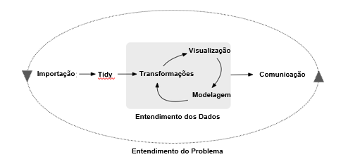
```

Note que aspectos como o deploy e a manutenção de modelo não estão sendo considerados neste flow. Isto porque, apesar da incontextável importância, tais fases tendem a priorizar outros aspectos, como integrações com sistemas, performance, e questões relacionadas, enquanto que para o ciclo pontuado acima, temos o entendimento e modelagem do problema como maior propósito. 

Visando descomplicar tais ciclos no contexto da programação R iremos trabalhar com a coleção de pacotes do `tidyverse`:


<!-- Para a apresentaçao das etapas do workflow da Ciência de Dados, vamos dar foco nas soluções do tidyverse, porém sempre comentando as soluções tradicionais via RBase - lembrando que existem dezenas de outras alternativas disponíveis, inclusive a possibilidade de desenvolvimento. -->


## O universo tidyverse 
O `tidyverse` é um conjunto de bibliotecas que compartilham a mesma gramática, contemplando todo o ciclo de análise da ciência de dados, tendo como base dados *tidy*, uma forma padronizada de vincular a estrutura de um conjunto de dados (seu layout físico) com sua semântica (seu significado). Para tal temos que, independente da origem, características, problemas e layout dos dados, estes precisam ser organizados de modo que:

- cada variável tenha a sua própria coluna;
- cada observação tenha a sua própria linha; e
- cada valor tenha a sua própria célula.

Apesar da simplicidade das premissas, o fato do pre-requisito existir e ser previsto no flow, garante recursos para o ajustes necessários, e coerência para todo o ecossistema. Assim, para entendermos melhor as características de dados, gramática e aspectos abordados, vamos instalar o `tidyverse` e discutir cada um destes pontos:

```{r, eval=F}
install.packages("tidyverse")
```


### Dados: Tidy
Conforme comentado, dados *tidy* possuem uma estrutura tal que: cada variável é representada por uma coluna, cada observação por uma linha, e cada valor possui sua própria célula. No R tal estrutura pode ser alcançada por meio dos `data.frames`, porém as bibliotecas `tidyverse` trabalham com uma estrutura mais moderna, chamada `tbl_df` ou `tibble`. A estrutura `tibble` é proveniente da biblioteca com o mesmo nome, um dos pacotes instalados pelo `tidyverse`, assim podemos carregar esta estrutura tanto com `library(tibble)` quanto com  `library(tibble)`. Como exemplo veremos como se comporta a base `mtcars` quando transformada para a estrutura `tibble`:

```{r}
#carregando a biblioteca para o uso de dados tidy
  library(tibble)
  
  #como data.frame (estrutura original)
    class(mtcars)
  #como tibble
    mtcars_2 <- as_tibble(mtcars)
    class(mtcars_2)
  #visualização como tibble:
    mtcars_2 
```

Note que a visualização que temos ao chamar os dados no formato tibble é muito mais simples e descritivo que a visualização original (que pode ser consultada na seção Análises Descritivas. Adicionalmente questões como performance e consistência também foram melhorados em relação aos data.frames.


Nesta temos uma coleção de bibliotecas projetadas para trabalhar: o conceito de dados *tidy* (via `tibble`), a gramática do operador pipe (`%>%`), e os pilares básicos de um workflow de ciência de dados. 


### Gramática: Pipe 
O Pipe é um operador, representado por `%>%`, que possibilita aplicar comandos em camadas, uma sequência de etapas aplicadas a um objeto principal. Assim ao invés de ler uma sequência de aplicações de dentro para fora, teriamos a leitura da esquerda para a direita:

```{r, eval=F}
#leitura de dentro para fora
  funçãoN(...(função2(função1(dados))))

#leitura da esquerda para a direita
  dados %>% função1() %>% função2() %>% ... %>% funçãoN()
  
```

Este operador não faz parte dos comandos básicos do R e, portanto, é necessário instalar alguma bliblioteca que o contemple. Originalmente o operador `%>%` faz parte da biblioteca `magrittr` (`install.packages("magrittr")`), podendo ser também utilizado por meio da biblioteca `dplyr`, um dos pacotes contidos no `tidyverse` - que discutiremos na sequência. 

```{r}
#carregando a biblioteca para uso do operador %>%
  library(magrittr)

#assim, aplicar o modulo, o log e arredondar para 2 casas decimais:
  round(log(abs(-3:3)),2)
#pode ser reescrito como:
  -3:3 %>% abs %>% log() %>% round(2)

```

> O operador `%>%`  pode ser chamado por meio do atalho `'ctrl + shift + M'` 


### Pilares: bibliotecas tidyverse
Assim, com o comando `library(tidyverse)` passamos a ter as seguintes bibliotecas instaladas e carregadas:

- **readr**: leitura dos dados <br></br>
- **tibble**: opção ao data frame, otimizada  <br></br>
- **tidyr**: reformulação de layout dos dados <br></br>
- **dplyr**: manipulação de dados <br></br>
- **ggplot2**: criação de gráficos <br></br>
- **purrr**: programação funcional <br></br>
- **forcats**: operações com variáveis categoricas <br></br>
- **stringr**: operações com strings <br></br>

A instalação do `tidyverse` traz ainda uma série de outras bibliotecas visando usos mais especializados: 

- **readxl**: leitura e escrita de arquivos .xls e .xlsx <br></br>
- **haven**: leitura e escrita de arquivos SPSS, Stata, e SAS <br></br>
- **lubridate**: operações para trabalhar com datas <br></br>
- **broom**: resume informações de modelagem de forma estruturada <br></br>
- **knitr**: relatórios dinâmicos <br></br>

Tais bibliotecas, apesar de instaladas, precisam ser carregadas individualmente (`library(readxl)`), o que traz todas as funções disponíveis na referida biblioteca. Ou, alternativamente, chamando a função de interesse apenas (`readxl::read_xlsx()`).

```{r, echo = F, message = F}
 library(tidyverse)
```

Somando todas estas bibliotecas ao `Rmarkdown`, que permite a execução de códigos e relatórios - mas que não precisa ser carregada, visto que o RStudio faz todo o load quando necessário. O workflow de análise passa a ser:

```{r , echo=FALSE, out.width = '50%', fig.align = "center", fig.cap="Ciclo de Ciência de Dados por Tidyverse"}
 knitr::include_graphics("Figs/Fig_2_DataScience_vs_Tidyverse.png")
```

> Para consultar as funções disponíveis nas principais bibliotecas do `tidyverse` acesse as folhas de consultas (*cheat sheets*), disponíveis no site oficial do RStudio.


## Importação 
Ao longo de todo fluxo iremos utilizar várias bases de dados que as próprias bibliotecas possuem - para consultar tais dados: `data()`. Contudo, em uma análise usual, o primeiro passo é a importação dos dados. Isto pode significar ler dados armazenados em arquivos, bancos de dados ou mesmo uma API da Web. Considerando o primeiro caso, temos o `read.table()` ou `read.csv()` como principais referências do RBase, enquanto que pelo `readr` (via `tidyverse`),  temos opções mais rápidas, com argumentos padronizados, e que produzem tibbles ao invés de data.frame. Seguem alguns exemplos para a leitura de um arquivo `"file"` considerando diferentes opções de extenção e delimitadores:

- `read_csv("file.csv")` - lê arquivos delimitados por vírgula
- `read_csv2("file.csv")` - lê arquivos delimitados por ponto e vírgula
- `read_delim("file.txt", delim="|")` - lê arquivos delimitados por tabulação (exemplo dado para o delimitador `|`)
- `read_fwf("file.fwf", col_positions = c(1,3,5))` - lê arquivos com largura fixa (exemplo dado para o padrão `1,3,5`)

Em todos os casos é possível especificar características como: nome das colunas, cabeçalho, linhas para serem puladas, ou ainda a pré-especificação da classe de cada uma das colunas do arquivo. Contudo, no caso deste último parâmetro não ser específicado, as funções do `readr` irão "adivinhar" a classe das colunas, retornando uma mensagem com tais específicações:

```{r}
read_csv(readr_example("mtcars.csv"))
```

Adicionalmente, além das opções `readxl` e `haven`, anteriormente citadas, o R dispõe de bibliotecas como: `DBI`, `jsonlite`, `xml2`, `httr` ou `sparklyr`.

### Diretórios e Projetos 
É importante saber que o R carrega os arquivos a partir do diretório de trabalho corrente, que pode ser consultado por meio da função `getwd()` - diretórios do Windows são especificados por meio de barras invertidas `/` ou `\\`. No caso do arquivo de interesse estar em outro diretório existem basicamente três alternativas: 

- especificar na leitura do arquivo, adicionando o diretório antes do nome do arquivo: `"diretorio/arquivo.ext"`; 
- mudar o diretório de trabalho em si, por meio da função `setdw()`; ou
- (** recomendado **) trabalhar com a opção de projetos do RStudio (`.RProj`). Nesta, o diretório em que o arquivo `.RProj` estiver salvo, passa a ser a pasta raiz de todas as análises. Assim todas as especificações dos arquivos de input/output, scripts, e etc, podem ser setados sem a necessidade de detalhar a localização exata do diretório. Tal prática, bem como a adoção de estruturas para a organização dos arquivos, facilitam a evolução e o compartilhamento do trabalho.

Para criar um projeto no RStudio, é necessário clicar no ícone superior à direita, conforme a imagem abaixo:

```{r , echo=FALSE, out.width = '70%', fig.align = "center", fig.cap="RStudio: Projeto"}
 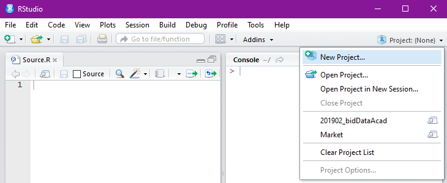
```

Posteriormente, para abrir o projeto, podemos ir no mesmo ícone, no `File/Open Project` ou ainda dando duplo click no arquivo `.Rproj`.


## Organização 
Após a importação dos dados, passamos para a etapa de organização, ou *tidying data*. Para isto iremos primeiramente visualizar os dados. No R existem váras funções `built-in` interessantes para fazer isso: `head()` que retorna as 6 primeiras linhas de uma base de dados, `names()` retorna o nome das colunas, o `str()` que traz uma linha para cada coluna, incluindo funções relacionadas às classes das colunas, ou ainda o `View()`, queexibe os dados em uma nova janela, permitindo filtros e ordenação, via point-and-click.

Todas as funções citadas são úteis, mas com o pacote `dplyr`, via `tidyverse`, passamos a ter ainda a função `glimpse()`, que retorna o número de observações (linhas) e variáveis (colunas) do input, seguido do nome das colunas, as respectivas classes e as observações que couberem no display do Console.

```{r}
#base para exemplo
  mtcars

#exemplo: função `glimpse` para visualização 
  mtcars %>% glimpse()
```

A partir da visualização começamos a fazer os ajustes necessários para garantir que os dados estejam organizado de uma forma `tidy`, utilizando para tal a biblioteca `tidyr`:

- **Manipulação de celulas**
  - `gather()` - reune colunas em linhas

```{r}
#base para exemplo
  table4a

#exemplo: passando as colunas para linhas
  table4a %>% 
    gather(`1999`, `2000`, key = "ano", value = "valores") 
```


- `spread()` - espalha linhas em colunas.

```{r}
#base para exemplo
  table2

#exemplo: passando linhas para colunas
  table2 %>% 
    spread(type,count) 
```

- **Manipulação de celulas**
  - `separate()` - divide uma única coluna em várias colunas.
  - `unite()` - combina várias colunas em uma única coluna.

```{r}
#base para exemplo
  table3 

#exemplo: separando a coluna rate em duas
  table3 %>%
    separate(rate, into = c("cases", "pop"))
```

- **Dados Faltantes**
  - `replace_na()` - substituí os dados faltantes por um valor especificado
  - `drop_na()` - excluí as linhas com dados faltantes. 

```{r}
#base para exemplo
  airquality %>% glimpse()

#exemplo: exclusão das linhas identificadas com NA
  airquality %>%
    drop_na() %>% 
    glimpse()
```

    
## Manipulação 
A próxima etapa no processo de análise é a manipulação da base, visando desde o entendimento de suas variáveis, considerando tabulações e estatísticas, até a criação de novas variáveis. Utilizando o pacote `dplyr` para tal, temos recursos para:

  - **Manipulação de variáveis**
    - `select()` - seleciona variáveis, permitindo o uso de recursos como:
        - `starts_with()`, `matches()`, `num_range()`, ou `everything()`  
    - `mutate()` - cria/modifica variáveis
    - `rename()` - renomeia variáveis

```{r}
#base exemplo
  iris %>% glimpse()

#exemplo: seleção, mudança de nome, e definição de uma nova variável 
  iris %>% 
    as_tibble() %>% 
    select(Sepal.Length) %>% 
    rename(variavel_original = Sepal.Length) %>% 
    #normalização feita com a função `scale` + `round` para arrendondamento 
    mutate(variavel_original_normalizada =  variavel_original %>% scale %>% round(digits=2)) %>% 
    glimpse()
```

  - **Manipulação de casos**
    - `filter()` - filtra linhas dos dados
    - `slice()` - seleciona linhas por suas posições ordinais
    - `arrange()` - ordena as linhas de acordo com as colunas especificadas
    - `distinct()` - reporta linhas únicas de uma dada entrada

```{r}
#exemplo: seleção baseada no padrão de nomenclatura, seguida de filtro e ordenação
  iris %>% 
    select(starts_with("Petal")) %>%
    filter(Petal.Length > 6, Petal.Width > 2) %>% 
    arrange(Petal.Width)
```


  - **Sumarização**
    - `summarise()` - calcula resumo de uma tabela
    - `group_by()` - agrupa dados por níveis categóricos
    
```{r}
#exemplo: calculo da quantidade de observações de cada categoria, média e desvio padrão da Petal.Length
  iris %>% 
  group_by(Species) %>% 
  summarise(N = n(),
            PetalLength_media = mean(Petal.Length),
            PetalLength_desvio = sd(Petal.Length))
```   
   
    
  - **Amostra**
    - `sample_n()` - seleciona uma amostra aleatória considerando o número de elementos especificado
    - `sample_frac()` - seleciona uma amostra aleatória considerando a proporção especificada
 
```{r}
#exemplo: obtenção de uma amostra considerando o número de observações desejado, seguido de uma amostra considerando proporção
  iris %>% 
  sample_n(10) %>% 
  sample_frac(0.5) 
```


  - **Combinando Bases**
    - `inner_join()` - retorna todas as linhas da base à esquerda que possuem valores correspondentes na base à direita. Se houver várias correspondências entre xe y, todas as combinações das correspondências serão retornadas.
    - `left_join()` - retorna todas as linhas de x e todas as colunas de x e y. Linhas em x sem correspondência em y terão valores de NA nas novas colunas. Se houver várias correspondências entre x e y, todas as combinações das correspondências serão retornadas.
    - `full_join()` - retornar todas as linhas e todas as colunas de xe y. Onde não há valores correspondentes, retorna NA para o ausente.
    
```{r, collapse = T}
#bases para exemplo
  band_members %>% glimpse()
  band_instruments %>% glimpse()
  band_instruments2 %>% glimpse()

#exemplo: em que as variáveis para join possuem nomes iguais
  left_join(band_members, band_instruments) %>% glimpse()

#exemplo: em que as variáveis para join possuem nomes diferentes
  left_join(band_members, band_instruments2, by = c("name"="artist")) %>%
    glimpse()
```

Conforme já comentado, existem bibliotecas para trabalharmos com diferentes classes de dados. Vamos citar algumas funcionalidades dos três pacotes com tal finalidade contidos no `tidyverse`:

  - **factors::**
    - `fct_count()` - conta o número de valores de cada nível
    - `fct_relevel()` - reordenar os níveis dos fatores
    - `fct_explicit_na()` - adicionar o `NA` como um dos níveis

```{r}
#base para exemplo
  gss_cat %>% glimpse

#exemplo: contabilizando a quantidade de religiões declaradas 
  gss_cat$relig %>% 
  fct_count() 
```

  - **strings::**
    - `str_detect()` - identificar a presença de padrões em uma string
    - `str_count()` - contabiliza o número de vezes que um padrão é encontrado
    - `str_replace()` - substitui um dado padrão em uma string 
    - `str_to_lower()` - converter strings maiúsculas e minúsculas

```{r}
#base para exemplo
  fruit %>% as_tibble %>% glimpse

#exemplo: obtenção da quantidade de palavras contendo a string "berry"
  fruit %>% 
    str_count("berry") %>% 
    sum()
    
```

  - **date::**
    - `as_date()` - converter um objeto para uma data ou hora 
    - `wday()` - retorna o dia da semana como um número decimal 
    - `today()` - retorna a data corrente 
    - `floor_date()` - arredonda para o limite inferior mais próximo da unidade de tempo

```{r, error=TRUE}
#exemplo: retorna erro por não ser uma data válida
  birthday <- lubridate::dmy("29/02/1971")
  
#data ok
  birthday <- lubridate::dmy("29/02/1972"); birthday
  
#lembrando que a biblioteca lubridate não é automaticamente carregada com o `tidyverse`, 
  wday(birthday, label = TRUE)
  
#para não precisar anteceder todas as funções com `lubridate::` podemos carregar o pacote
  library(lubridate)
  
#obtenção do dia da semana da data especificada
  wday(birthday, label = TRUE)

```


## Visualização 
Gráficos são ferramentas poderosas para a visualização de gráficos, e, quando devidamente utilizados, permitem ao usuário o entendimento das informações de uma forma rápida, permitindo novas questões, hipóteses, necessidades ou pontos de atenção. Por meio do RBase temos várias opções gráficas que nos permitem gráficos genéricos:

```{r, out.width = '60%', fig.align = "center"}
#base para exemplo
  mtcars %>% glimpse

#exemplo: gráfico de dispersão 
  plot(mtcars$mpg, mtcars$disp)
#exemplo: histograma
  hist(mtcars$disp)
#exemplo: gráficos de dispersão para todas as combinações dois a dois das colunas selecionadas
  plot(mtcars[,1:4])
```

Porém, com a biblioteca `ggplot2`, passamos a trabalhar com gráficos de uma perspectiva mais flexível, onde o gráfico é trabalhado como um mapeamento de atributos, e assim podemos dividi-lo em camadas. Assim, a partir da especificação das variáveis no comando `ggplot()`, adicionamos camadas por meio do simbolo `+`, o que nos permite especificar o tipo de gráfico, título, rótulos, etc:

```{r, out.width = '60%', fig.align = "center"}
#exemplo: gráfico de dispersão 
  mtcars %>% 
    ggplot(aes(x=mpg, y=disp)) +
    geom_point()

#exemplo: histograma
  mtcars %>%
    ggplot(aes(x=disp)) +
    geom_histogram()
```

Assim temos opções de gráficos como: `geom_boxplot`, `geom_area`, ou `geom_col`, além de uma série de opções para estilização, como: sistema de coordenadas, escalas, cores, posição, cores, legendas, quebras, etc.

```{r, out.width = '60%', fig.align = "center"}
#exemplo: gráfico ggplot
  mtcars %>% 
    ggplot(aes(x = mpg, y = disp, color = as.factor(cyl))) + 
    geom_point() + 
    facet_grid(~as.factor(vs)) +
    stat_smooth(method = 'lm') + 
    labs(title = "variável 'mpg' x 'disp', com quebra por 'vs' e ajuste por 'cyl'")
```

Para visulização dos gráficos de dispersão dois a dois, uma opções é trabalhar com a biblioteca `GGally`, uma das extenções do ``ggplot2`, que permite uma visão mais limpa e completa, uma vez que também retorna a correlação entre os pares e a distribuição indivídual das variáveis:

```{r, out.width = '60%', fig.align = "center"}
 mtcars[,1:4] %>%
  GGally::ggpairs()

```


## Modelagem 
Após um entendimento mais profundo sobre os dados, seu comportamento, natureza e especificidades, podemos passar para a fase de modelagem. Assim, tendo as perguntas bem especificadas, podemos utilizar um modelo para respondê-las. No `tidyverse` a biblioteca `broom` é direcionada para esta etapa da análise, porém de um ponto de vista de integração. Isto porque tem como finalidade transformar resultados de modelos estatísticos e de machine learning em objetos com formato *tidy*, facilitando desde o entendimento e comunicação resultado, visto a integração com as muitas ferramentas do `tidyverse`, quanto a comparação entre   diferentes modelos. O R possui como uma de suas bibliotecas default o `stats`, contemplando uma série de funções estatísticas, como, por exemplo, para o ajuste de um modelo de regressão linear simples:

```{r}
#exemplo: regressão linear simples
  fit <- lm(Sepal.Width ~ Petal.Length + Petal.Width, data = iris)
#e ao invés de visulizar os dados com os comandos abaixo 
  fit
  summary(fit)
  
#podemos utilizar um dos comandos da biblioteca `broom`   
  broom::tidy(fit)
```

Em relação à modelagem em si, visto ser algo que demanda conhecimentos prévios, não iremos nos aprofundar. Contudo segue uma lista com opções de bibliotecas para algumas metodologias/áreas:

- Árvore de Decisão - `part` e `rpart`
- Clusterização - `stats`, `cluster` e `fpc`
- Deep Learning - `keras`
- Random Forest - `randomForest`
- Redes Neurais - `nnet`, `neuralnet` e `RSNNS`
- Regressões - `stats`, `nlme` e  `gbm`
- Séries Temporais - `forest` e `dtw`
- Text Mining - `tm` e `wordcloud`
- Validação Cruzada - `caret`


## Programação
Como ferramenta transversal a todas as etapas do workflow de análise, temos a programação funcional, que permite a criação de códigos mais rápidos, simples e reproduzíveis. No contexto do `tidyverse` a biblioteca `purrr` disponibiliza de uma série de funcionalidades visando aprimorar a programação funcional no R. Como principal função temos o `map()`, transformando a sua entrada por meio da aplicação de uma função a cada elemento, e retornando uma lista com o mesmo comprimento que a entrada:


```{r}
#exemplo: , contabilização de tal identificação de dados faltantes por coluna, 
  starwars %>% 
    map(is.na) %>% #identificação de quais elementos, de cada coluna, são NA's
    map(sum) %>% #contabilização dos dados faltantes por coluna  
    glimpse() #sumarização do resultado

#outras opções de sintaxe para obter o mesmo resultado
  #starwars %>% map(~sum(is.na(.)))
  #starwars %>% map( function(x) sum(is.na(x)) )
```

O `map()` retorna listas por default, para que o resultado tenha outra estrutura/classe, podemos utilizar funções como: `map_dbl` que retorna um vetor número, `map_dfc` para um data.frame que combina os resultados por coluna, entre outras opções. Adicionalmente temos recursos como:

  - `walk()` - similar ao `map`, porém sem ter o retorno da lista no console 
  - `pmap()` - aplica uma função a um grupo de elementos de um grupo de listas
  - `append()` - adiciona valores ao fim de uma lista

Com tais recursos podemos, por exemplo, visulizar todos os arquivos de um dado diretório:

```{r, eval=F, warning = F}
#exemplo
  list.files("\diretório", pattern='*.xlsx') %>% 
    map(read_excel) %>% 
    walk(glimpse)
```


## Comunicação
Por fim temos a apresentação dos resultados, uma parte crítica do processo, visto que, usualmente, é neste momento que toda a análise passa a ter um significado prático. Para tal podemos exportar as informações de interesse para outras ferramentas, como excel, power point, ou etc, o que não costuma ser muito prático. Como alternativa podemos fazer a análise e montar o report conjuntamente pelo R, garantindo reprodutibilidade e histórico, por meio do Rmarkdown. Tal recurso trata-se de uma extensão do R, que permite que padrões básicos de formatação sejam utilizados, além de pedaços de código, imagens, e etc, possibilitando a geração de diferentes tipos de documentos a partir do Script do R:


```{r , echo=FALSE, out.width = '40%', fig.align = "center", fig.cap="RMarkdown"}
 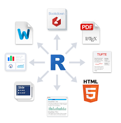
```

Para criar tais arquivos basta ir em 'File > New File > R Markdown ...', preencher as especificações do Documento, e então apertar o botão Knit, ou o atalho 'Ctrl + Shift + K'.


<!--------------------------------------------------> ____
# R para Big Data
O R, por padrão, trabalha com dados carregados em memória, por meio de processamento sequencial, o que pode limita tanto o tamanho da base de dados que podemos trabalhar, quanto a velocidade de análise. Alternativas para quando estamos sob alguma destas limitações incluem: trabalhar com amostragens, usar um computador com mais recursos, acessar os dados considerando outras formas, ou segmentar de dados. Trataremos aqui das duas últimas opções:

- outras formas de acesso: 
  - substituir os data.frames/tibbles pelo data.table, da biblioteca `data.table()`, uma vez que este trabalha com otimização de processamento e memória;
  - processar os dados em disco, ao invés da memória, por meio de bibliotecas como `bigmemory` e `ff`;
  - dado que o R é por padrão uma linguagem interpretada, utilizar funções como `compile()` ou `enableJIT()` para acelerar o processamento de uma análise, principalmente se ela for executada repeditamente; e
  - utilizar pacotes que possibilitam paralelismo, como `Foreach` ou `Multicore`.

- segmentação: aqui podemos trabalhar "manualmente", carregando sub-conjuntos das base de dados, analisando cada uma delas, e depois combinando os resultados. Ou carregar bibliotecas que permitam integração do R com o ecossistema de Big Data, permitindo a distribuição e análise de forma automática. O `RHadoop`, por exemplo, é um conjunto de pacotes que permite conectar o ambiente R em clusters HDFS e HBASE para a execução de operações. Outra opção é o `sparklyr`, que possibilita a execução de comandos do R em clusters do Apache Spark.
Tanto o `RHadoop` quanto o `sparklyr` possibilitam o uso de comandos do pacote `dplyr`, e a sintaxe do `tidyverse()`. Assim, as tecnologias se complementam: é possível escrever código de forma mais simples e rápida no R e executá-lo distribuidamente em grandes bases de dados no Hadoop ou Spark, e podemos alavancar os tradicionais sistemas de Big Data, integrando a eles as funcionalidades de análise e machine learning disponíveis no ecossistema do R.

Visando ilustrar a facilidade de tais integrações, segue a aplicação do mesmo conjunto de códigos anteriormente utilizados para a base `mtcars`:


```{r}
#carregando da biblioteca após sua instalação
#library(sparklyr)

#conectando com o sparkly
#spark_conexao  <- spark_connect(master = "local")

  #xxx

#Disconnect from Spark
#spark_disconnect(sc = spark_conexao)

```

Vale ressaltar que muitas das soluções que envolvem Big Data no R são novas, assim como o ecosistema de Big Data em si. E, portanto, estão em constante desenvolvimento, aumentando ainda mais a importância de manter o tracking de melhorias e correções dos pacotes. Vale ressaltar que mesmo com toda a necessidade de ajustes aqui apresentada, a quantidade de recursos que o R oferece para o flow da Ciência de Dados, faz com que grandes empresas, como Google, Microsoft, Bank of America e Shell, optem por trabalhar com a linguagem R.

<!-- R lets you write data analysis code quickly. With a bit of care, you can also make your code easy to read, which means that you can easily maintain your code too. In many cases, R is also fast enough at running your code. -->

<!-- Unfortunately, R requires that all your data be analyzed in memory (RAM), on a single machine. This limits how much data you can analyze using R. There are a few solutions to this problem, including using Spark. -->

<!-- Spark is an open source cluster computing platform. That means that you can spread your data and your computations across multiple machines, effectively letting you analyze an unlimited amount of data. The two technologies complement each other strongly. By using R and Spark together you can write code fast and run code fast! -->

<!-- sparklyr is an R package that lets you write R code to work with data in a Spark cluster. It has a dplyr interface, which means that you can write (more or less) the same dplyr-style R code, whether you are working with data on your machine or on a Spark cluster. -->

<!-- Before you get too excited, a word of warning. Spark is still a very new technology, and some niceties like clear error messages aren't there yet. So when things go wrong, it can be hard to understand why. -->

<!-- sparklyr is newer, and doesn't have a full set of features. There are some things that you just can't do with Spark from R right now. The Scala and Python interfaces to Spark are more mature. -->

<!-- That means that you are sailing into uncharted territory with this course. The trip may be a little rough, so be prepared to be out of your comfort zone occasionally. -->

<!-- One further note of caution is that in this course you'll be running code on your own personal Spark mini-cluster in the DataCamp cloud. This is ideal for learning the concepts of how to use Spark, but you won't get the same performance boost as you would using a remote cluster on a high-performance server. That means that the examples here won't run faster than if you were only using R, but you can use the skills you learn here to run analyses on your own big datasets. -->

<!-- If you wish to install Spark on your local system, simply install the sparklyr package and call spark_install(). -->

# Considerações Finais 
Além das soluções e bibliotecas aqui comentados, é importante lembrar que o R oferece muitas formas de completar uma mesma atividade. Sendo assim, é sempre recomendado que procure opções para otimizar sua rotina. Seguem abaixo as algumas referências open-source para o aprofundamento dos pontos aqui listados:

- R for data science: https://r4ds.had.co.nz/introduction.html
- Advanced R: http://adv-r.had.co.nz/
- Hands-On Programming with R: https://rstudio-education.github.io/hopr/
- Curso-R: https://www.curso-r.com/material/

Vamos agora fazer um ciclo de análises considerando arquivos do Santander. 

Boa sorte! 


<!-- Falar sobre escopo/environment  -->
<!-- working environment ~ global  -->
<!-- falar sobre require  -->
<!-- falar sobre warnings  -->
<!-- rmarkdown  -->

<!-- - Web apps interativos (Shiny) - xxx -->
<!-- - Apresentações (Xaringan) - Xxx -->
<!-- - Análise de dados (Sparkly) - xxx -->
<!-- - Criação de pacotes (devtools) - xxx -->

<!-- funções importantes: -->
<!-- - :: :::	 #access variables in a namespace -->
<!-- - $ @	 #component / slot extraction -->
<!-- - ~	 #as in formulae -->

<!-- Para acesso das informações temos ama Uma da Subsetting Vocabulário focado em algumas funções essenciais (summary, [, \$, %in%, print, cat, str, table,plot, ifelse e as funções *pply) -->

<!-- - **Opções point and click** <br> -->
<!-- Point-and-click Graphical User Interfaces (GUIs) para o R permite que análises sejam feitas no R sem um conhecimento prévio de programação. Apesar deste não ser o objetivo deste material, apresentaremos aqui os nomes das opções mais populares : rcmdr, rattle, jamovi, deducer e jmv -->

<!-- Rtools - Trata-se de um conjunto de ferramentas que permitem a construção de bibliotecas no Windows, além do acesso a algumas bibliotecas. O processo de instalação é similar ao do R, bastando fazer o download da versão mais atual da ferramenta no site do R Project:  -->
<!-- <!-- https://nugaemeae.wordpress.com/2012/08/30/the-why-and-the-how-of-installing-rtools - print da lista de Rtools no site -->

